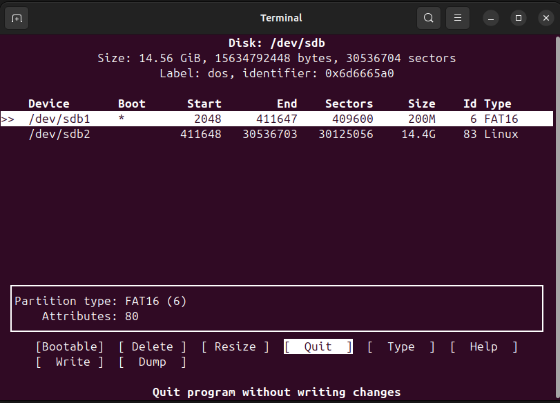
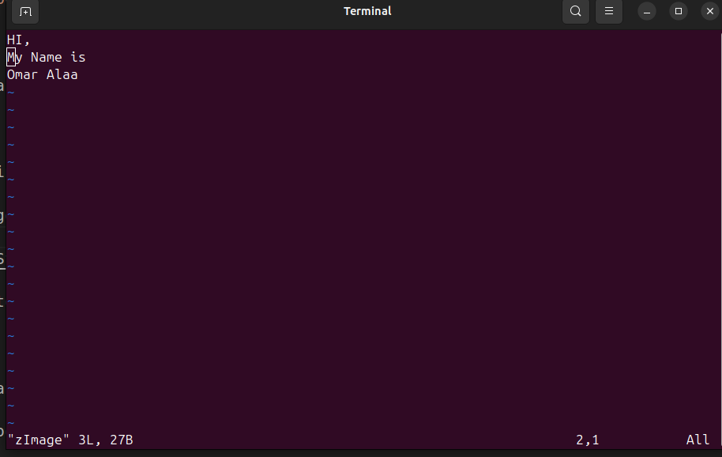
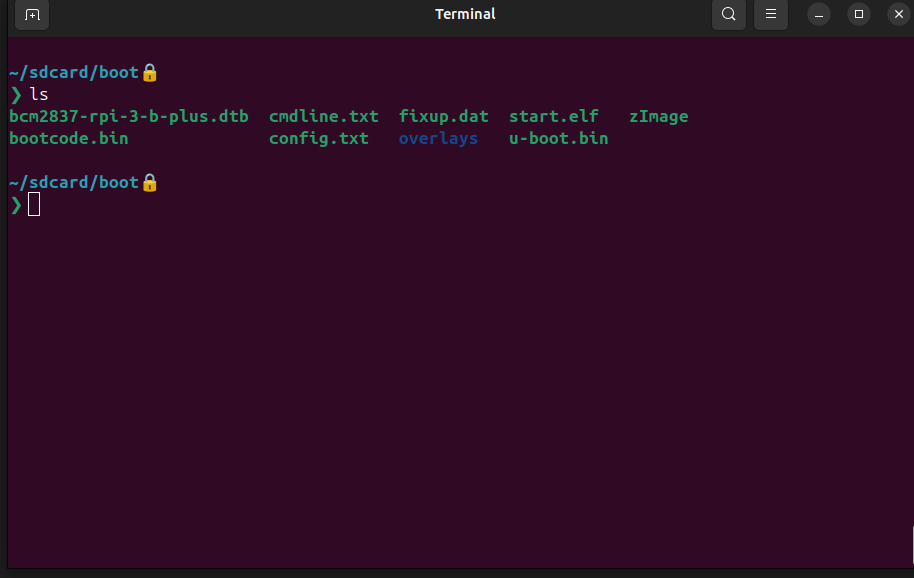
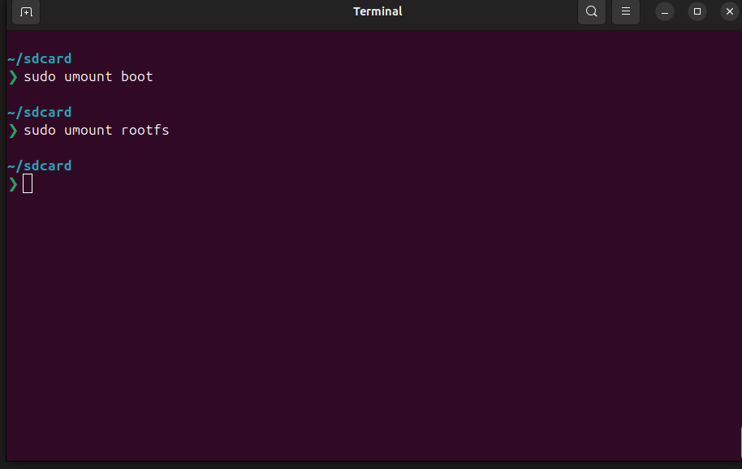
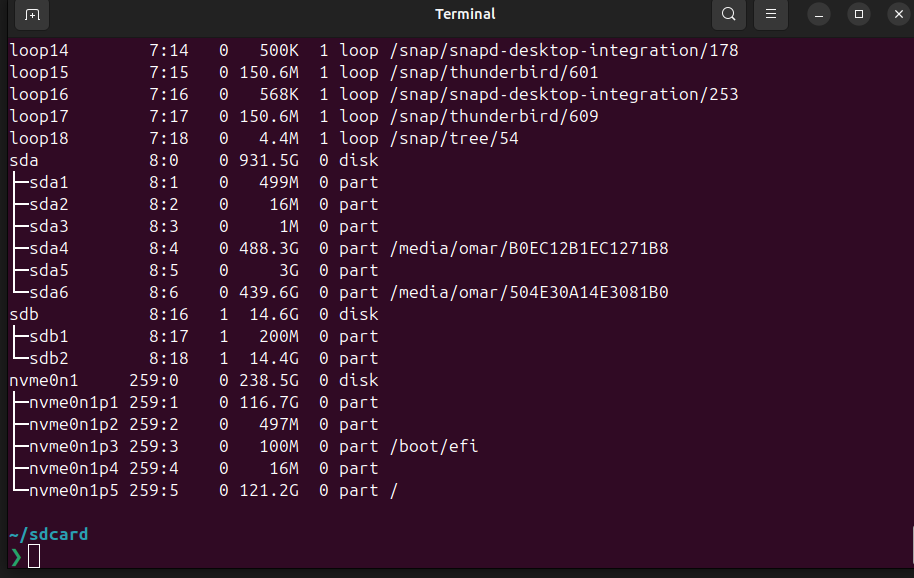
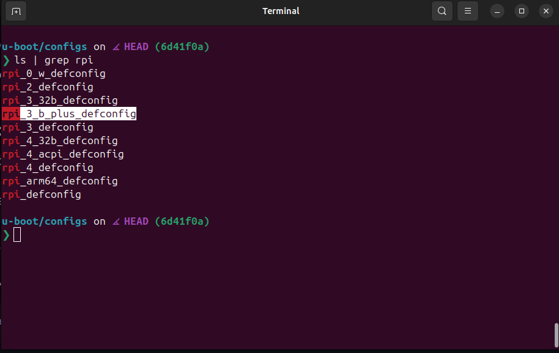
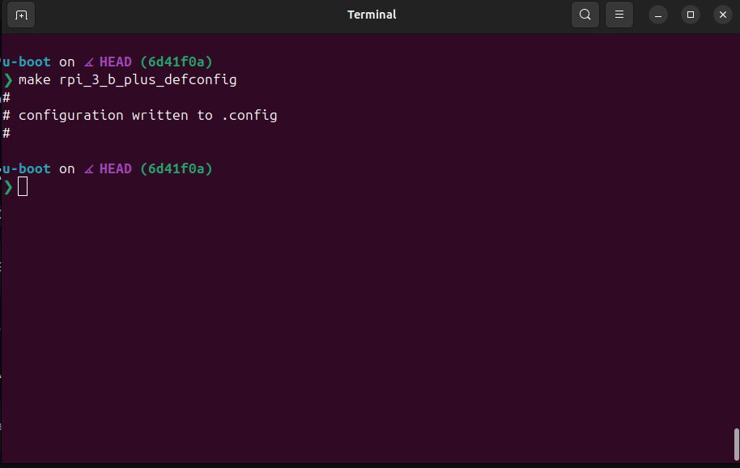
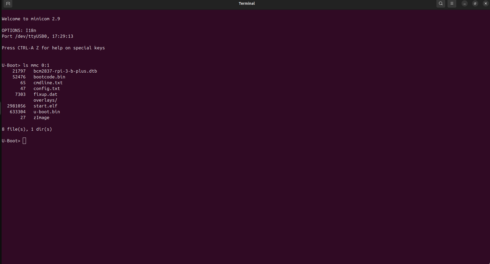
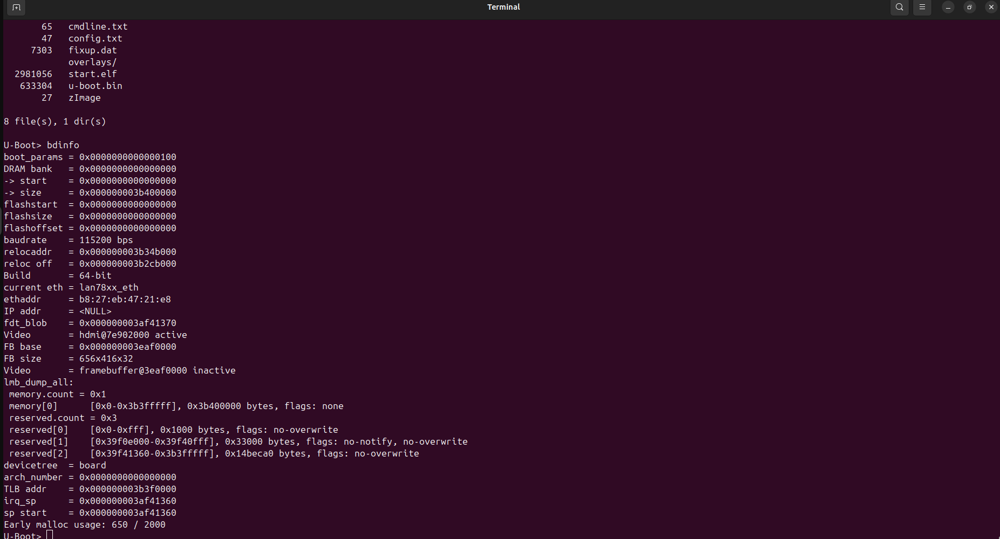
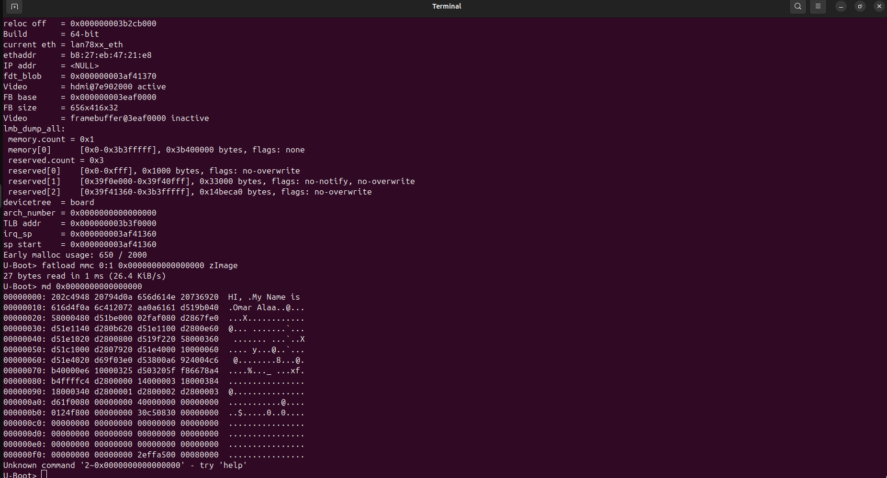

# Task3_Uboot_Rpi

## U-boot setup with physical sdcard and Raspberry Pi 3 Model B+

- In this README.md I provide steps to use U-boot and set the configuration of it
and use physical sdcard and at the end I will use Raspberry Pi 3 Model B+ to see the output.

### First Step: Prepare physical `Sdcard`

#### 1- Hard Format if it used before
  - dd: A low-level command used for copying and converting data
  - if: input file 
  - of: output file
  - bs: block size
  - count: how many blocks will generate in the sd.img  
```
dd if=/dev/zero of=sdb bs=2M count=1
```
#### 2- Creat partition in SD card
```
sudo cfdisk /dev/sdb
```
- cfdisk: Creat header of the memory (MBR) 
  - Select DOS partition table.
     - Create:
        - 200MB Primary Partition (set as bootable, type FAT16).
        - Extended Partition for the remaining space (type EXT4).



#### 3- Create mount points 
- create two directories for boot and root filesystem 
```
mkdir boot rootfs
```


#### 4- Partitions formating
```
sudo mkfs.vfat -F 16 -n boot /dev/sdb1
```
- Explanation:
  * mkfs.vfat → Creates a FAT filesystem (typically used for USB drives, SD cards, and boot partitions).
  * -F 16     → Specifies FAT16 as the filesystem type.
  * -n boot   → Assigns the volume label boot to the partition.
  * /dev/sdb1 → The target partition (first partition on the sdcard).
```
sudo mkfs.ext4  -L rootfs /dev/sdb2
```
- Explanation:
  * mkfs.ext4 → Formats the target partition as an ext4 filesystem (commonly used for Linux root filesystems).
  * -L rootfs → Sets the volume label to rootfs (a typical name for root filesystems).
  * /dev/sdb2 → Specifies the second partition on the sdb2 as the target.

#### 5- Mount partitions
```
sudo mount /dev/sdb1  sdcard/boot
```
```
sudo mount /dev/sdb2  sdcard/rootfs
```
#### 6- Check mount points
- Lists block devices and verifies the mounted partitions.
```
lsblk
```


#### 7- Add boot content 
- Go to the `boot` directory 
```
cd  boot
```
- Then creat a `zImage` file (fake file)
```
touch zImage
```
- write anything inside this file using `vim` 
```
sudo vim zImage 
```


- Copy Files to Boot Partition
   - Copy all required `files`, including `u-boot.bin`, to the boot partition:
```
sudo cp -r ~/PATH/OF/RPi3_Firmware/* .
```



- retun back to the `sdcard` directory
```
cd ..
```
- umont boot and rootfs directories
```
sudo umount boot
```
```
sudo umount rootfs
```




### Second Step:Clone and Build `U-Boot` 

#### 1- Clone U-boot
 - clone the latest version 
```
git clone git@github.com:u-boot/u-boot.git
```
 - checkout to the latest `tag` 
```
cd u-boot
```
```
git chechout v2025.01
```
#### 2- Make configuration based on board 
- Go to configs directory 
```
cd u-boot/configs
```
- Search for specific target 
```
ls | grep rpi
```
- make new configuration
```
make rpi_3_b_plus_defconfig
```


- Applies the default configuration for rpi_3_b_plus_defconfig.
```
make menuconfig
```
* Navigate to Environment settings.
   * Enable FAT filesystem.
   * Set the block device, partition, and environment:
   * Block device: mmc
   * Partition: 0:1 (FAT partition).
- Note : Disable flash option 


#### 3- Set up the `cross-compiler`
- Search for specific variable  
```
cat Makefile | grep CROSS_COMPILE
```
- Make a global variable to set cross compiler
```
export CROSS_COMPILE=~/x-tools/aarch64-omar-linux-gnu/bin/aarch64-omar-linux-gnu-
```
- Ensures the correct toolchain is used for `rpi`.

- Build `U-boot`
```
make -j12
```


### Third Step:Using Rpi for Booting 
#### 1. Insert the SD Card
- Insert the physical SD card into the Raspberry Pi.

#### 2. Connect via USB-TTL
- Connect the Raspberry Pi to your computer using a USB-TTL serial cable.

#### 3. Start Minicom
- Open a terminal to interact with U-Boot using Minicom:
```
sudo minicom -D /dev/ttyUSB0
```

#### 2- Interact with U-Boot
- List FAT partition contents:
```
ls mmc 0:1
```
- Get DRAM address:
```
bdinfo
```
- Load zImage into DRAM:
```
fatload mmc 0:1 0x60000000 zImage
```
- Verify zImage in memory:
```
md <address>
```




